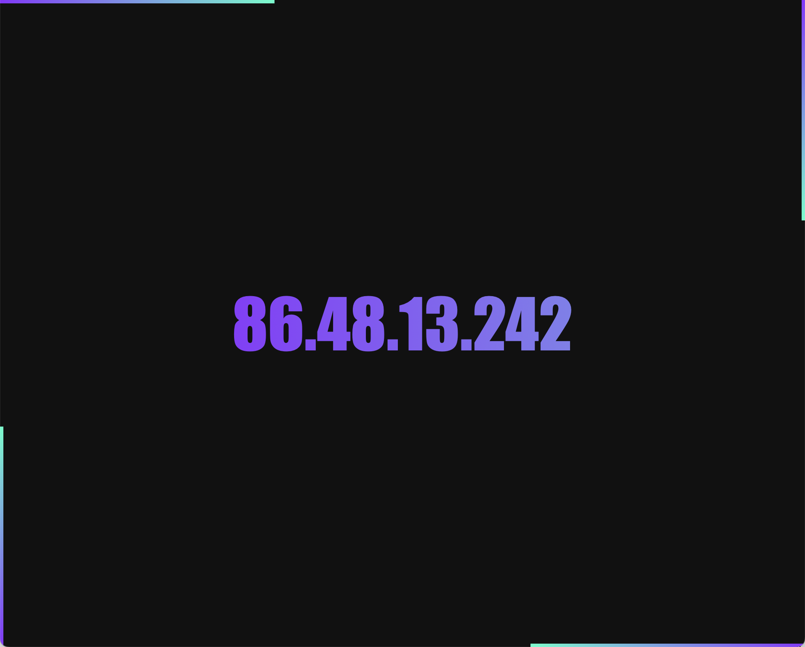

# Your IP Address Viewer


A minimalistic web page that displays the visitor's IP address (and hostname if available) with animated gradient styling, auto-scaling, copy-to-clipboard functionality, and beautiful loading bars.

---

## ✨ Features

- 🔍 Automatically displays:
  - IP address
  - Hostname (if resolvable)
- 🎨 Dynamic animated gradient per host/IP
- 📏 Auto-fit long IPv6 addresses using JavaScript scaling
- 🖱 Click-to-copy with visual feedback (`Copied`)
- ⚡ Loading animation bars on all four screen edges
- 📱 Mobile responsive design (no line breaking, no overflow)
- 🖥 CLI support: `curl` or `wget` returns plain IP only

---

## 📸 Preview

```
curl https://yourdomain.example/ip
```

```
203.0.113.42
```

Web view:



---

## 🛠 Installation

1. Clone the repository:

```bash
git clone https://github.com/yourusername/ip-viewer.git
```

2. Upload files to your PHP-enabled web server (Apache, nginx, etc.).

3. Access via browser or curl:

```
https://yourdomain.example/ip
```

---

## 🔧 Configuration

No config needed. But you can customize:

- Font sizes (`host-style` / `ip-style`)
- Gradient behavior and animation speed
- Loading bar visibility
- Default font (Impact)

---

## 📦 File Structure

```
/
├── index.php         # Main program logic
├── screenshot.png    # (Optional) Preview image
└── README.md         # This file
```

---

## 🧠 How It Works

- Uses PHP’s `$_SERVER["REMOTE_ADDR"]` and `gethostbyaddr()` to determine client info.
- Detects CLI tools (e.g., `curl`, `wget`) via `HTTP_USER_AGENT`.
- Uses `crc32()` hash to generate consistent gradient hues.
- JavaScript `transform: scale()` resizes long host/IP to fit in one line.

---

## ⚙️ Dependencies

- ✅ PHP 7.0+ (CLI detection, hostname lookup)
- ❌ No frameworks
- ✅ Pure HTML, CSS, and vanilla JavaScript

---

## 📜 License

MIT License © [Your Name]

Feel free to use, modify, and deploy 🚀

---