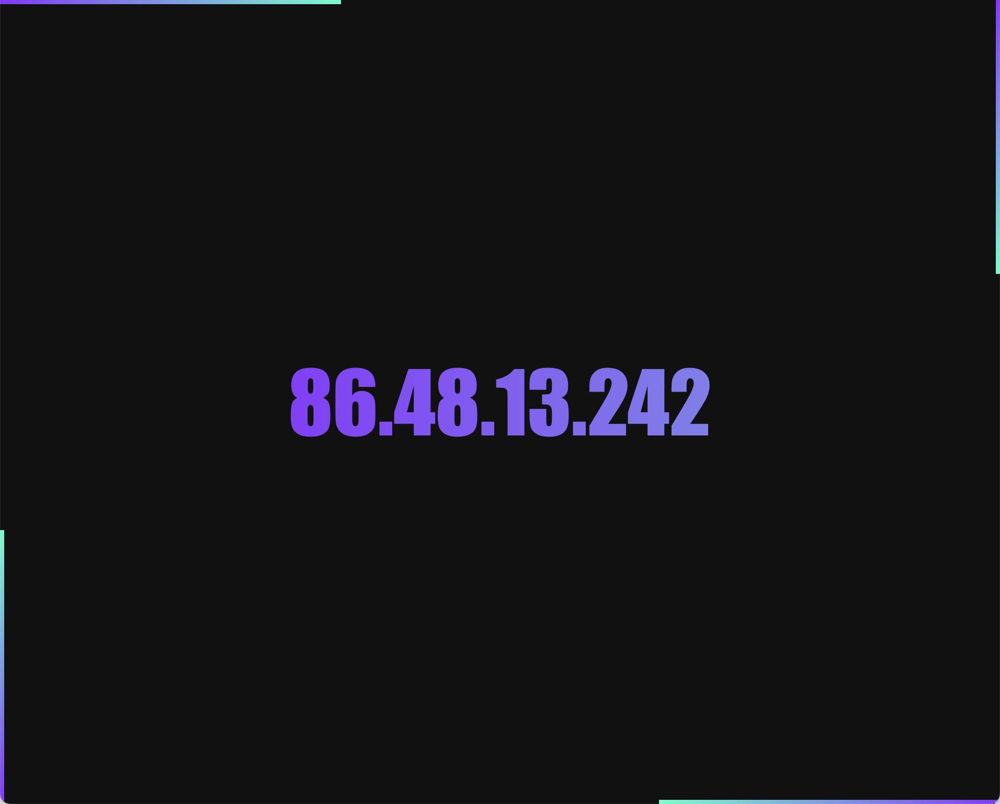

# Show My Address



A minimalistic web page that displays the visitor's IP address (and hostname if available) with animated gradient styling, auto-scaling, copy-to-clipboard functionality, and loading bars.

---

## ✨ Features

- 🔍 Automatically displays:
  - Client IP address
  - Hostname (if reverse DNS is resolvable)
- 🌐 Proxy/CDN-aware client IP resolution (with trusted proxy validation)
- 🚫 No-cache response headers to avoid stale IP display after network changes
- 🎨 Dynamic animated gradient per IP prefix
- 📏 Auto-fit long IPv6 addresses/hostnames using JavaScript scaling
- 🖱 Click-to-copy with visual feedback (`Copied` / `Copy Failed`)
- ♿ Keyboard-accessible copy targets (`Tab`, `Enter`, `Space`)
- 🧏 Screen-reader status announcements for copy result
- ⚡ Loading animation bars on all four screen edges
- 🧘 `prefers-reduced-motion` support
- 🖥 CLI support: `curl` / `wget` / `httpie` / `fetch` returns plain IP only
- ⌨️ Keyboard shortcuts overlay (`?` / `h`)

---

## 📸 Preview

CLI:

```text
curl https://yourdomain.example/ip
```

```text
203.0.113.42
```

Web view:


---

## 🛠 Installation

1. Clone this repository:

```bash
git clone https://github.com/yourusername/show-my-address.git
```

2. Upload files to a PHP-enabled web server (Apache, nginx, etc.).
3. Access via browser or CLI:

```text
https://yourdomain.example/ip
```

---

## ⚙️ Configuration

No configuration is required for basic usage.

### `TRUSTED_PROXIES` (recommended for CDN/reverse proxy setups)

Set trusted proxy CIDRs/IPs as a comma-separated environment variable:

```bash
TRUSTED_PROXIES="127.0.0.1,::1,10.0.0.0/8,192.168.0.0/16,203.0.113.10"
```

When `REMOTE_ADDR` matches one of these trusted proxies, the app will resolve client IP from headers in this order:

1. `CF-Connecting-IP`
2. `True-Client-IP`
3. `X-Forwarded-For` (first valid IP)
4. `X-Real-IP`
5. Fallback to `REMOTE_ADDR`

If `REMOTE_ADDR` is **not** trusted, forwarded headers are ignored for safety.

---

## 🧠 Current Implementation Details

- Sends non-cache headers on every response:
  - `Cache-Control: no-store, no-cache, must-revalidate, max-age=0`
  - `Pragma: no-cache`
  - `Expires: 0`
  - `Surrogate-Control: no-store`
- Detects CLI user agents (`curl`, `wget`, `httpie`, `fetch`) and returns plain text IP immediately.
- Performs `gethostbyaddr()` only for web rendering path.
- Uses SHA-1 hash of IP prefix to derive stable hue values for gradients.
- Uses JS `transform: scale()` to keep long host/IP text on one line.
- Uses Clipboard API with fallback (`document.execCommand("copy")`) for broader compatibility.
- Respects reduced-motion user preference.

---

## ⌨️ Keyboard Shortcuts

| Key       | Action |
|-----------|--------|
| `w`       | Open `iplocation.io` WHOIS for current IP |
| `p`       | Open `iplocation.io` ping for current IP |
| `l`       | Open `networksdb.io` for current IP |
| `s`       | Open Cloudflare Speed Test |
| `b`       | Open MXToolbox blacklist check for current IP |
| `j`       | Open BrowserLeaks JavaScript info |
| `t`       | Open Test IPv6 |
| `r`       | Reload page |
| `?` / `h` | Toggle help overlay |

---

## 📦 File Structure

```text
/
├── index.php
├── screenshot.png
├── web-preview.png
└── README.md
```

---

## ⚙️ Requirements

- PHP 7.0+
- No frameworks required
- Pure PHP + HTML + CSS + vanilla JavaScript

---

## 📜 License

MIT License © UNCHAINED ,LLC

Feel free to use, modify, and deploy 🚀
